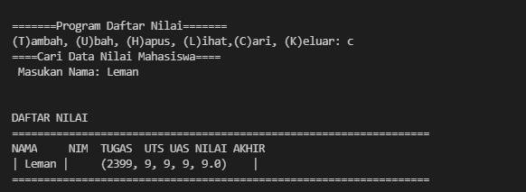

# **Tugas Pertemuan 12**
__Nama  : Leman__
__Nim   : 312110148__
__Kelas : T1.21.C1__

# Praktikum7
## Program Sederhana *(T)ambah, (U)bah, (H)apus, (L)ihat,(C)ari, (K)eluar* menggunakan class

### **PENJELASAN**

* Buatlah kamus yang akan diinput oleh data<p>
```pyhton
data = {}
```

* Buatlah definisi class dari program <p>
``` py
class mhs():
```

* __Membuat methode atau fungsi untuk mengakses nilai mahasiswa__<p> 
1. Method tambah() untuk menambah data <p>
2. Method tampilkan() untuk menampilkan data<p>
3. Method hapus(nama) untuk menghapus data berdasarkan nama<p>
4. Method ubah(nama) untuk mengubah data berdasarkan nama<p>
5. while True untuk untuk menangkap dan menjalankan menu yg diinputkan oleh user

* Ketika program dijalankan pertama kali, maka akan muncul tampilan seperti ini :<p>


Terdapat 6 pilihan dalam program yakni *(T)ambah, (U)bah, (H)apus, (L)ihat,(C)ari, (K)eluar*
* Tambah<p>
source code:
``` py
def tambah():
        print("Tambah Data")
        nama = input("Nama\t\t: ")
        nim = int(input("NIM\t\t: "))
        tugas = int(input("Nilai Tugas\t: "))
        uts = int(input("Nilai UTS\t: "))
        uas = int(input("Nilai UAS\t: "))
        nilaiakhir = (tugas * 0.3 + uts * 0.35 + uas * 0.35)
        data[nama] = nim, tugas, uts, uas, nilaiakhir
```
Untuk menambah data, user harus mengetikkan "t" pada pilihan menu.
Berikut ini adalah contoh ketika program dijalankan
<p>

* Lihat<p>
source code:
``` py
def tampilkan():
        if data.items():
            print("DAFTAR NILAI")
            print("======================================================================================")
            print("|  No  |      NIM      |      NAMA         |    TUGAS   |   UTS   |   UAS   | AKHIR  |")
            print("|======|===============|===================|============|=========|=========|========|")
            i = 0
            for a in data.items():
                i += 1
                print(f"| {i:4} | {a[0]:13s} | {a[1][0]:17} | {a[1][1]:10d} |  {a[1][2]:6d} | {a[1][2]:7d} | {a[1][4]:6.2f} | ")
        else:
            print("DAFTAR NILAI")
            print("======================================================================================")
            print("|  No  |      Nama     |      NIM      |   TUGAS  |   UTS   |   UAS   | Nilai Akhir  |")
            print("======================================================================================")
            print("|      |               |             Tidak Ada Data         |         |                |")
        print("======================================================================================")
```
Untuk melihat data, user harus mengetikkan "l" pada pilihan menu,seperti dibawah ini:
<p>

* Cari<p>
source code:
``` py
def cari():
        print("====Cari Data Nilai Mahasiswa====")
        nama = input(" Masukan Nama: ")
        if nama in data.keys():
            print("\n")
            print("DAFTAR NILAI")
            print("==================================================================")
            print("NAMA     NIM  TUGAS  UTS UAS NILAI AKHIR")
            print("| {0} |     {1}    | ".format(nama, data[nama]))
            print("==================================================================")
        else:
            print("Datanya {0} tidak ada ".format(nama))
```
Untuk mencari data, user harus mengetikkan "c" pada pilihan menu,seperti dibawah ini:
<p>

* Ubah<p>
source code:
``` py
def ubah():
        print("=====Edit Data Nilai Mahasiswa=====")
        nama = input("Masukan Nama\t\t: ")
        if nama in data.keys():
            nim = input("NIM baru\t\t: ")
            tugas = int(input("Nilai Tugas Baru\t: "))
            uts = int(input("Nilai UTS Baru\t\t: "))
            uas = int(input("Nilai UAS Baru\t\t: "))
            nilaiakhir = (tugas * 30 / 100 + uts * 35 / 100 + uas * 35 / 100)
            data[nama] = nim, tugas, uts, uas, nilaiakhir
            print()
            print("BERHASIL MENGUBAH DATA")
            print("======================")
        else:
            print("Data nilai {0} tidak ada ".format(nama))
```
Untuk mengubah data, user harus mengetikkan "u" pada pilihan menu,seperti dibawah ini:
<p>

* Hapus<p>
source code:
``` py
def hapus():
        print("Hapus Data Nilai Mahasiswa")
        nama = input(" Masukan Nama\t:")
        if nama in data.keys():
            del data[nama]
            print()
            print("=====BERHASIL MENGHAPUS DATA=====")
        else:
            print("Data {0} tidak ada".format(nama))
```
Untuk menghapus data, user harus mengetikkan "h" pada pilihan menu,seperti dibawah ini:
<p>

* Keluar<p>
Untuk keluar dari program, user harus mengetikkan "k" pada pilihan menu,seperti dibawah ini:
<p>

* Menangkap dan menjalankan inputan user
source code:
``` py
while True:
    print("\n=======Program Daftar Nilai=======")
    pil = input("(T)ambah, (U)bah, (H)apus, (L)ihat,(C)ari, (K)eluar: ")
    if pil.lower() == "l":
        mhs.tampilkan()
    elif pil.lower() == "t":
        mhs.tambah()
    elif pil.lower() == "u":
        mhs.ubah()
    elif pil.lower() == "h":
        mhs.hapus()
    elif pil.lower() == "c":
        mhs.cari()
    elif pil.lower() == "k":
        print()
        print("====== KELUAR DARI PROGRAM ======")
        break
    else:
        print("\nAnda memasukkan pilihan yang salah")
```


